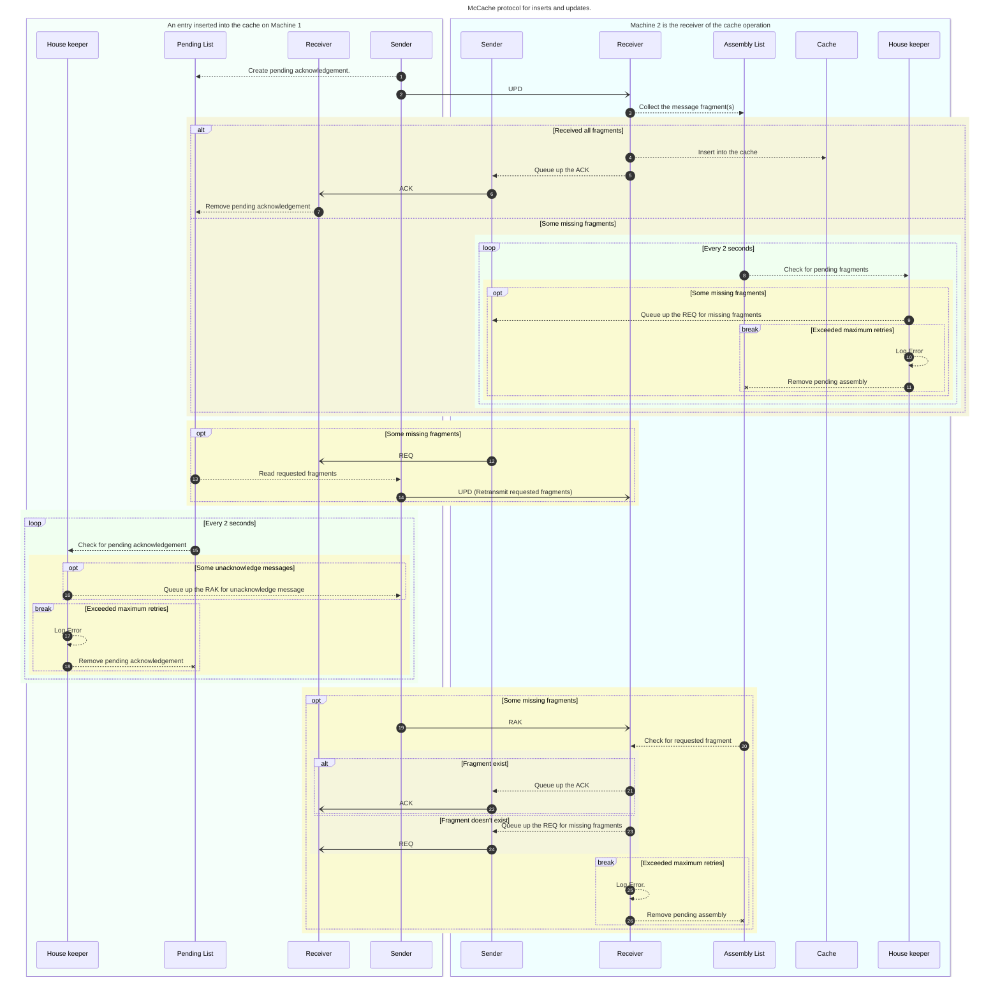
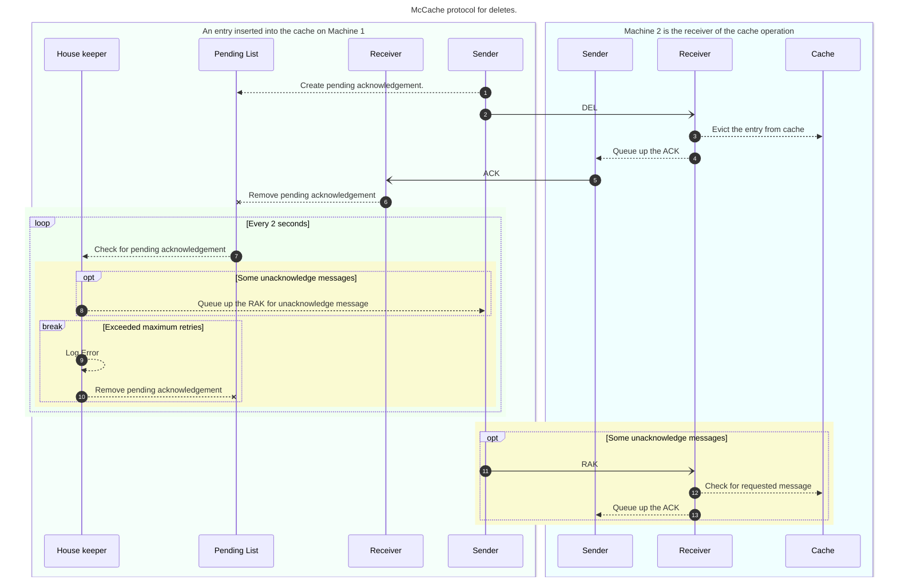

# Communication Protocol

The following are the operation code that are send between nodes to communicate their intent with each other.
|Op Code|Description|
|:------|:----------|
|ACK    |Acknowledgement of a received message.|
|BYE    |Member announcing it is leaving the group.|
|DEL    |Member requesting the group to evict the cache entry.|
|ERR    |Member announcing an error to the group.|
|INI    |Member announcing its initialization to the group.|
|INQ    |Member inquiring about a cache entry from the group.|
|MET    |Member inquiring about the cache metrics from the group.|
|NEW    |New member annoucement to join the group.|
|NAK    |Negative acknowledgement.  Didn't receive the key/value.|
|NOP    |No operation.|
|RAK    |Request acknowledgment for a key.|
|REQ    |Member requesting resend message fragment.|
|RST    |Member requesting reset of the cache.|
|UPD    |Update an existing cache entry (Insert/Update).|

<<<<<<< HEAD
onLY `DEL` and `UPD` will require acknowledgment from the receiving node(s).
=======
only `DEL` and `UPD` will require acknowledgment from the receiving node(s).
>>>>>>> main

## Joining and leaving the cluster.
```mermaid
---
title: McCache protocol to join and leave the cluster.
---
sequenceDiagram
<<<<<<< HEAD
    box lightblue   Machine 1
    participant HS  as Housekeeper
    participant S   as Sender
    end
    box lightgreen  Machine 2
    participant R   as Receiver
    participant HR  as Housekeeper
    end
    S->>R: NEW
    S->>R: BYE
=======
    box MintCream   Machine 1
    participant HS  as Housekeeper
    participant S   as Sender
    end
    box Azure  Machine 2
    participant R   as Receiver
    participant HR  as Housekeeper
    end
    S -) R: NEW
    S -) R: BYE
>>>>>>> main
```

## Insert/Update a value in the cache.


## Delete a value in the cache using the key.

